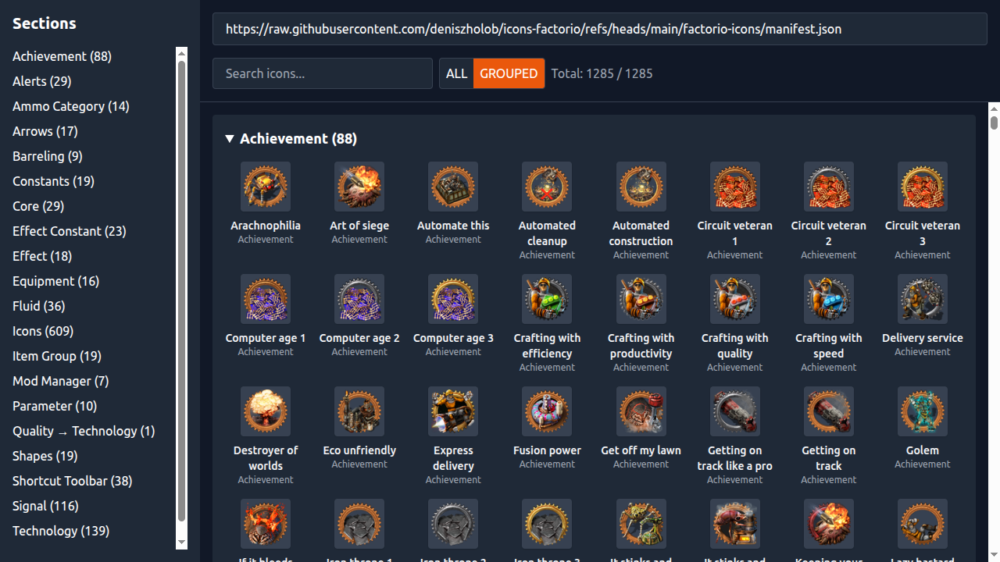

# Icons viewer

App to view icons using an icon manifest file such as
https://raw.githubusercontent.com/deniszholob/icons-factorio/refs/heads/main/factorio-icons/manifest.json

## Deployments 

- Master branch is for the source code that's hosted on
  [GhPages](https://deniszholob.github.io/icons-viewer/)

# Support Me

If you find the cheat sheet or the source code useful, consider:

- Donating Ko-fi: https://ko-fi.com/deniszholob
- Supporting on Patreon: https://www.patreon.com/deniszholob

# Screenshots

